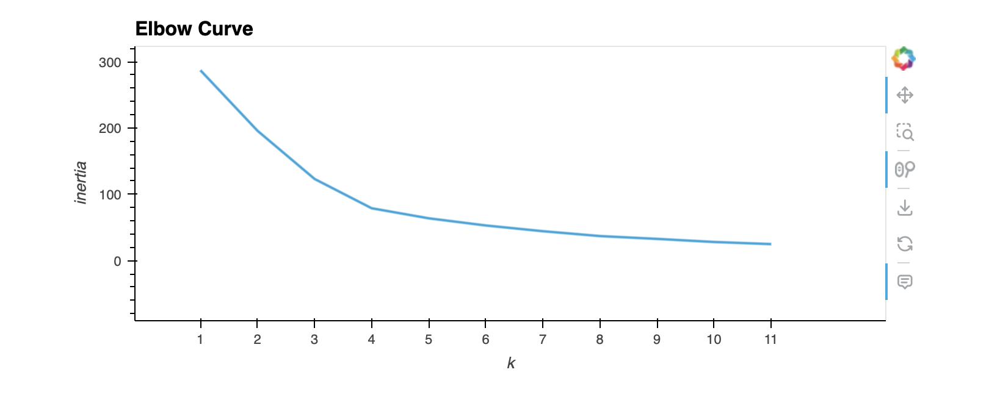
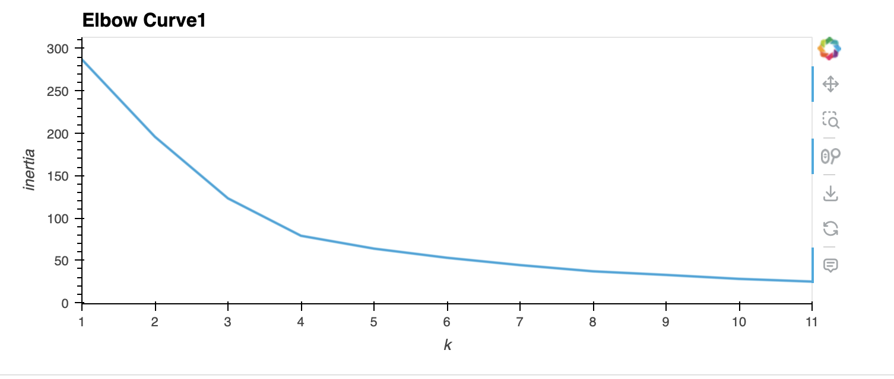
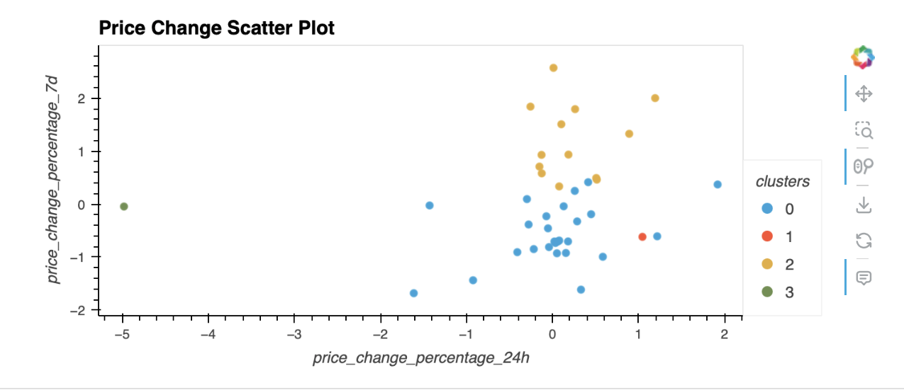
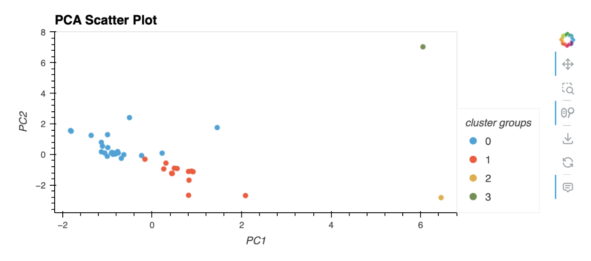

# Crypto Clustering

## Overview
#### This challenge we will cluster cryptocurrencies by their performance in different time periods. We will then plot the results so that you can visually show the performance to the board.

## Instructions
1. Import the Data (provided in the starter code)
2. Prepare the Data (provided in the starter code)
3. Find the Best Value for k Using the Original Data
4. Cluster Cryptocurrencies with K-means Using the Original Data
5. Optimize Clusters with Principal Component Analysis
6. Find the Best Value for k Using the PCA Data
7. Cluster the Cryptocurrencies with K-means Using the PCA Data
8. Visualize and Compare the Results

## Getting Started

* Elbow Curve

*Elbow Curve PCA

* Price Change Scatter Plot

* Price Change Scatter Plot PCA

## Results
#### After visually analyzing the cluster analysis results, It is evident that employing K-Means to cluster the data with a reduced number of features had a significant impact.

